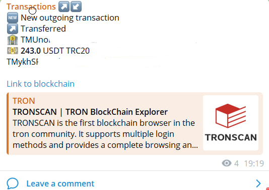

# Бот для трекинга транзакций в криптовалбтных блокчейнах
Данный бот предназначен для отслеживания транзакций в сетях TRON, BCS, BTC и ETH
## Возможности бота
Бот может отслеживать транзакции с лагом не более 1 минуты. Реализована защита от "пылевых" транзакций, белый список, 
защита от несанкционированного доступа и разделение админских 
и пользовательских записей.

Бот общается через тг. Пример уведомления о транзакции:


## Запуск бота на своем устройстве
Бот контенеризован с помощью Docker. Для поднятия на чистой машине с 0 необходимо выполнить следующие действия:

<b>!!! ВНИМАНИЕ. ДАННЫЕ КОМАНДЫ ПРИВЕДУТ К ПЕРЕУCТАНОВКЕ ДОКЕРА!!!</b>

### Install docker

```bash
sudo apt-get remove docker docker-engine docker.io containerd runc
sudo apt-get update
sudo apt-get install \
    ca-certificates \
    curl \
    gnupg \
    lsb-release
sudo mkdir -p /etc/apt/keyrings
curl -fsSL https://download.docker.com/linux/ubuntu/gpg | sudo gpg --dearmor -o /etc/apt/keyrings/docker.gpg
echo \
  "deb [arch=$(dpkg --print-architecture) signed-by=/etc/apt/keyrings/docker.gpg] https://download.docker.com/linux/ubuntu \
  $(lsb_release -cs) stable" | sudo tee /etc/apt/sources.list.d/docker.list > /dev/null

sudo apt-get update
sudo apt-get install docker-ce docker-ce-cli containerd.io docker-compose-plugin
```


### Install docker-compose 

```bash
sudo apt -y install curl
sudo curl -L "https://github.com/docker/compose/releases/download/1.29.2/docker-compose-$(uname -s)-$(uname -m)" -o /usr/local/bin/docker-compose
sudo chmod +x /usr/local/bin/docker-compose
```

### Run bot
```bash
git clone https://github.com/NikolaevMIPT/Nikolaev_bot.git
cd Nikolaev_bot && docker-compose up -d --build
```

После этого необходимо инициализировать БД вручную первичным админским пользователем

## Работа с ботом
Для получения информации используйте команду /help. При возникновение больших проблем пишите на почту nievni@gmail.com

## Стурктура проекта

В папке bot содержатся функции управления ботом

В папке db содержатся функции взаимодействия с БД PostgreSQL

В папке checking_funks содержится основная логика сбора и агрегации данных транзакций. Да поможет вам бог в этой зоне...